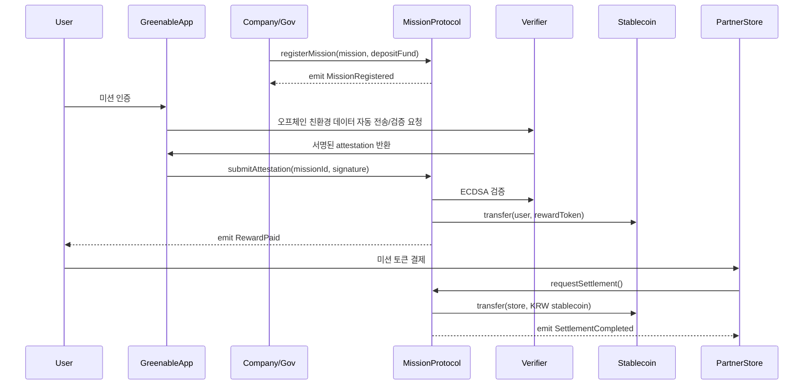

# greenable-v1-core
> 본 Repo는 Greenable 플랫폼에서 사용되는 미션 등록, 인증, 보상 지급, 자동 정산 등의 온체인 로직을 구현한 `core` 모듈입니다.  

---

## Protocol Overview

**Greenable Mission Protocol**은 기업/지자체가 설계한 친환경 미션을 온체인에서 관리하며, 한국 원화(KRW) 연동 스테이블코인 기반 리워드와 ESG 성과 검증을 지원하는 플랫폼입니다.  

- **미션 등록/운영**: 기업/지자체는 텀블러 사용, 음식물 쓰레기 감축 등 ESG 미션을 등록하고 자금을 예치합니다.  
- **인증/보상 지급**: 참여자의 행동은 교통/결제/IoT 데이터와 AI 분석으로 자동 검증되며, 즉시 KRW 스테이블코인 리워드가 지급됩니다.  
- **자동 정산**: 제휴처는 사용자 결제 시점에 스마트 컨트랙트를 통해 원화 정산을 즉시 수령합니다.  
- **ESG 성과 데이터화**: 참여율, CO₂ 감축량, 리워드 내역이 자동 집계되어 기업·지자체용 ESG 리포트로 생성됩니다.  

---

## Lite Paper
플랫폼의 문제 인식, 해결 방안, 서비스 구조 및 기대 효과는 라이트 페이퍼에서 확인할 수 있습니다.  

👉 [Lite Paper](./doc/Greenable-Litepaper.pdf)  

---

## Demo
데모 영상을 통해 실제 동작 시나리오를 확인할 수 있습니다.  

👉 [Demo Link](https://www.youtube.com/watch?v=uBEBqdUeqLk)  

---

## Main Flow



---

## Repository Structure
```
src/        # 스마트 컨트랙트 소스 코드 (Solidity contracts)
    ├─ AchievementNFT.sol
    ├─ MissionProtocol.sol
    └─ missionToken.sol
lib/        # 외부 라이브러리 (External libraries)
    ├─ forge-std/
    └─ openzeppelin-contracts/
test/       # Foundry 기반 테스트 코드 (Test codes)
    ├─ AchievementNFT.t.sol
    └─ MissionProtocol.t.sol
script/     # 배포 및 유틸리티 스크립트 (Deployment & utility scripts) [추가 예정]
docs/       # Lite Paper, 다이어그램, 빌드 가이드 (Docs, diagrams, guides) [추가 예정]
```

---

## Build & Test (Foundry)

이 프로젝트는 Foundry를 기반으로 합니다.

1. Install Foundry
```
curl -L https://foundry.paradigm.xyz | bash
foundryup
```

2. Build
```
forge build
```

3. Test
```
forge test
```
