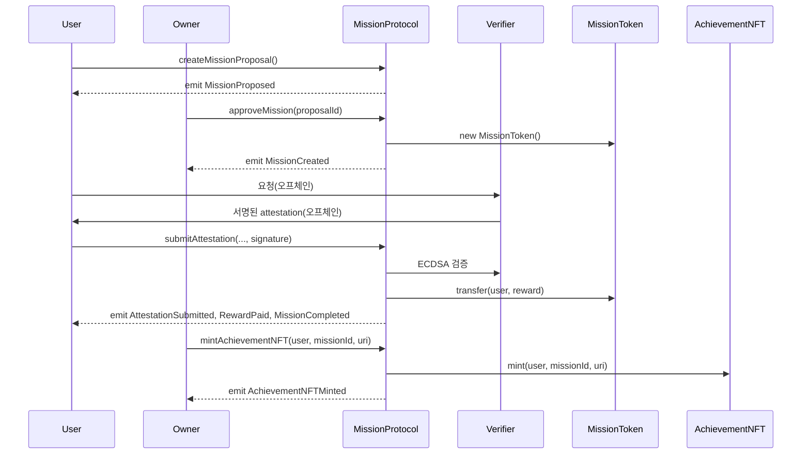

# WE-v1 Mission Protocol

## Protocol Overview

WE-v1 Mission Protocol은 미션 제안, 승인, 인증(Attestation), 보상 지급, 업적 NFT 발행을 지원하는 온체인 미션 플랫폼입니다.

- **미션 제안/승인**: 사용자가 미션을 제안하면, 오너가 승인하여 실제 미션이 생성됩니다.
- **인증/보상**: 사용자는 검증기관의 서명을 받아 미션 수행을 인증하고, 보상을 청구할 수 있습니다. 하루에 여러 번 인증이 가능합니다.
- **NFT 발행**: 오너는 미션을 완료한 사용자에게 업적 NFT를 발행할 수 있습니다.

### 주요 흐름 (Mermaid 시퀀스 다이어그램)

---