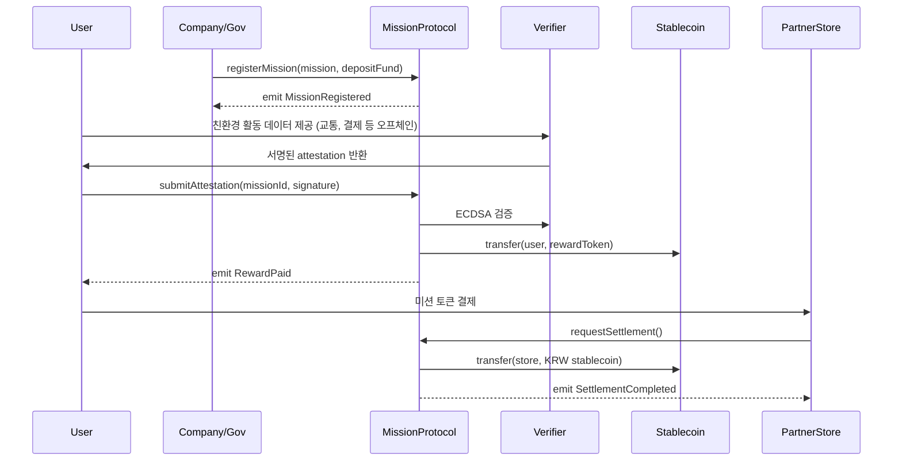

# greenable-v1-core

> **Greenable Lite Paper 기반 서비스의 핵심 스마트 컨트랙트 레포지토리**  
> 본 레포는 Greenable 플랫폼에서 사용되는 미션 등록, 인증, 보상 지급, 자동 정산 등의 온체인 로직을 구현한 `core` 모듈입니다.  

---

## Protocol Overview

**Greenable Mission Protocol**은  
기업/지자체가 설계한 친환경 미션을 온체인에서 관리하며, 한국 원화(KRW) 연동 스테이블코인 기반 리워드와 ESG 성과 검증을 지원하는 플랫폼입니다.  

- **미션 등록/운영**: 기업/지자체는 텀블러 사용, 음식물 쓰레기 감축 등 ESG 미션을 등록하고 자금을 예치합니다.  
- **인증/보상 지급**: 참여자의 행동은 교통/결제/IoT 데이터와 AI 분석으로 자동 검증되며, 즉시 KRW 스테이블코인 리워드가 지급됩니다.  
- **자동 정산**: 제휴처는 사용자 결제 시점에 스마트 컨트랙트를 통해 원화 정산을 즉시 수령합니다.  
- **ESG 성과 데이터화**: 참여율, CO₂ 감축량, 리워드 내역이 자동 집계되어 기업·지자체용 ESG 리포트로 생성됩니다.  

---

## Lite Paper
플랫폼의 문제 인식, 해결 방안, 서비스 구조 및 기대 효과는 라이트 페이퍼에서 확인할 수 있습니다.  

👉 [Lite Paper]()  

---

## Demo
데모 영상을 통해 실제 동작 시나리오를 확인할 수 있습니다.  

👉 [Demo Link]()  

---

## 주요 흐름 (Mermaid 시퀀스 다이어그램)



---

## Repository Structure
```
contracts/    # 스마트 컨트랙트 소스 코드
script/       # 배포 스크립트
test/         # Foundry 기반 테스트 코드
docs/         # Lite Paper, 다이어그램, 빌드 가이드
```

---

## Build & Test (Foundry)

이 프로젝트는 Foundry를 기반으로 합니다.

1. Install Foundry
```
curl -L https://foundry.paradigm.xyz | bash
foundryup
```

2. Build
```
forge build
```

3. Test
```
forge test
```
